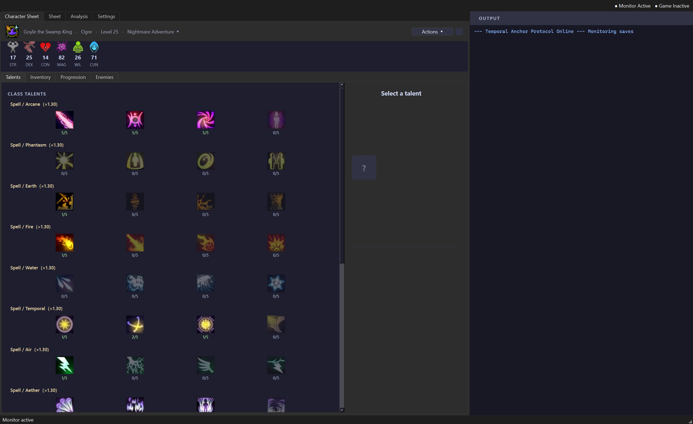
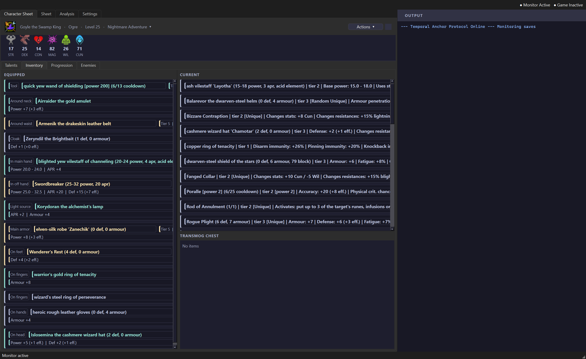

# Tales-of-Maj-Eyal-Save-Game-Monitor
A project i started to back up my save file, has evolved into an game guidance tool. There is a lot of information this game and its hard to gauge how dangerous an enemy is.

What is this for?
- Manage save games of all alive characters. If you aren't satisfied with your character's recent death, you can revert back to the last save
- Reveal what dangerous enemies are in the map
- Character sheet overview
- Build analysis

Current Preview 17/04/2026

What is the build analysis?
- To begin with this will be based on the top official Madness roguelike winner builds
